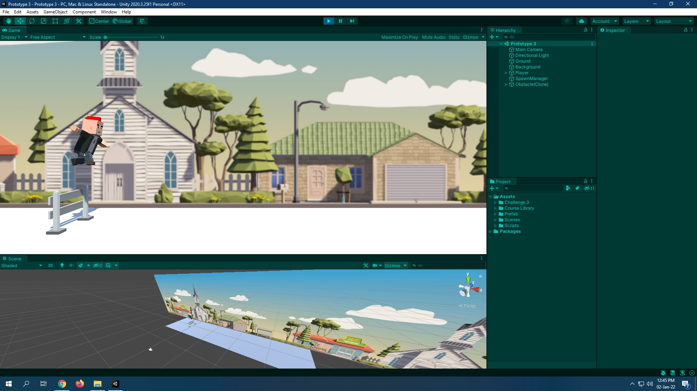

# CWC_Prototype3-Unity
Unity Learn - Junior Programmer: Create with Code 2 - Unit 3: Sound and Effects.

***main*** branch contains the game created by myself.

***fabricated*** branch contains the game created with help of the solutions.

